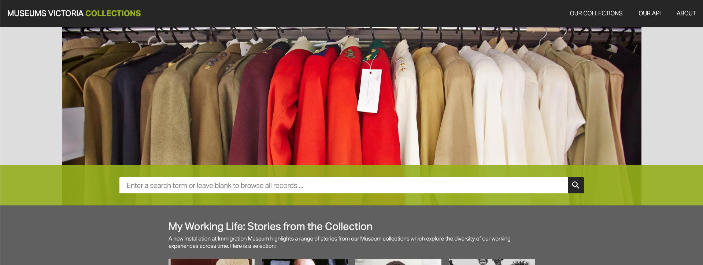

# Museums Victoria Project

## Aims
In this project I aimed to take a novel and user centred approach to the Museum Victoria Collections website and API, and in so doing widen its potential audience. The current website is a database, effective but not inviting or intuitive. It has a clear and well structured search function, good for someone with a clear goal, but not interesting or usable for the average interested user or student. 

I took inspiration from other websites that made their content more appealing to different audiences, a great example is the MET Kids website. The MET Kids website is the best example because it goes the furthest in transforming a detailed collection into an accessible and fun experience for those that would find it the hardest to engage with that content. It is colourful and image driven, with different options to explore the collection. Notably, I resonated most with the way it focused on the users interest, and showed restraint with the number of options it gave as to not cause information overload. 

I aimed to apply the same methodology to the Museum Victoria Collection website, to create an engaging experience focusing on the user’s interest and curiosity, and to facilitate exploration. Noting that the MET Kids website even edited its item content for children, I decided not to go as far as tailoring it for children and instead for average interested people and students from 10 and up. 

For the design, I aimed to create a visually engaging yet professional site. Notably, the Museums Victoria Collections website was not aligned with the design of the Museums Victoria website - which appears to me to be more professional, light, and modern. So I aimed to make them consistent and coherent, so the collections website could be integrated and be available to a wider audience. 

## Initial Design
The initial design focused on two core elements - the initial search, and the item and subsequent search. 

The initial search needed to be visually engaging, and have a reduced number of options to minimise information overload and encourage going into an item as soon as possible. 

An important and subtle point I picked up on was that both the MET Kids and Museum Victoria Collections website were reliant on their search page - forcing the user to go back to the main search page after finding an item. I thought that this was a stilted experience, and it created fatigue to repeat the search process repeatedly. My thinking was that if you had found an item of interest, then you already knew what the user was interested in - and you could give them an experience of going ‘down the rabbit hole’ and exploring areas related to their chosen item. This, I hoped, would also create more time in items and less time searching. 

## Execution

### The search and API
The search functionality needed to be accessible in the interface, but more sophisticated under the hood. It required reworking the basic events API call from the Canberra Modern website into a more sophisticated method. 

I first needed to get it working as a separate call that could be linked to a button rather than on page load, then it needed to integrate page values for API call. This required finding a small number of useful filters that could also be visually engaging - I found locality, category, and collection area for these. I had to experiment to find the right query structure and combine the parameters.

Once the search was functional, it needed to be visually engaging - so I bound the category and collection area to images with a hover, and locality to a map. This required nursing the CSS for the map in particular, for the locations to remain in the right location as the screen changed, with some success and challenges (noted later). 

I thought that search also needed to be accompanied by a display of what the user was filtering for and a clear button so they can remove their search parameters if it didn’t return results that were interesting to them, or at all. This required making a set of display parameters that were set at the same time as the query parameters. 

I also thought that the user would want to filter the item results after they came back from the API, so I implemented a search filter that only returned the results that contained the users search term. I added a for loop that added only those that matched the search result in the title. 

Finally, I adapted this search function for the item page - instead adapting it to search for only the category that is selected and on the button press of that category. 

### Visual Design
Given the aims for a professional yet inviting design, I decided to match a professional visual design with conversational language. I used the Museums Victoria logo, but added the ‘Collections’ below to match with the main website. I added clear headers and footers in the Museums Victoria colour, and added a shadow for added depth and a professional feel. For the item I emphasised the description in a pop-out to be more visually engaging. As stated previously, I added images and the map on the main page for a more hands-on and interesting experience. 

For the mobile design I adjusted the arrangement and sizing to better fit the screen size, but the overall structure didn’t require any changes to fit. 

## Future Improvements

### Design Improvements
There were  some additional design additions I would have liked to make with additional resources with Museums Victoria. Most notably the content of the items page. As noted the MET Kids website has dedicated copy for children to make it more accessible, and I would have liked to do the same - with ‘fun facts’ and more interesting copy. I also would have liked to add images, but the current Collections website does this quite well and I wanted to focus on the new elements rather than reinventing the wheel.

### Technical Improvements

I also had a set of technical improvements I would have liked to make with more time. The map didn’t stay as accurately to the location with screen sizes as I would have liked. I also would have liked to have the user search filter on more than the title, and have an approximate match rather than an exact match. The search also didn’t handle pagination. Also having text appear when there are no results for the query, or letting the user know before they search if the return will have no results. 

I also thought that the interest-focused nature of the website would create useful data for Victoria Museums which could be used to surface the most interesting items and categories as ‘Featured’. It also would provide useful information for exhibits and the like. 
